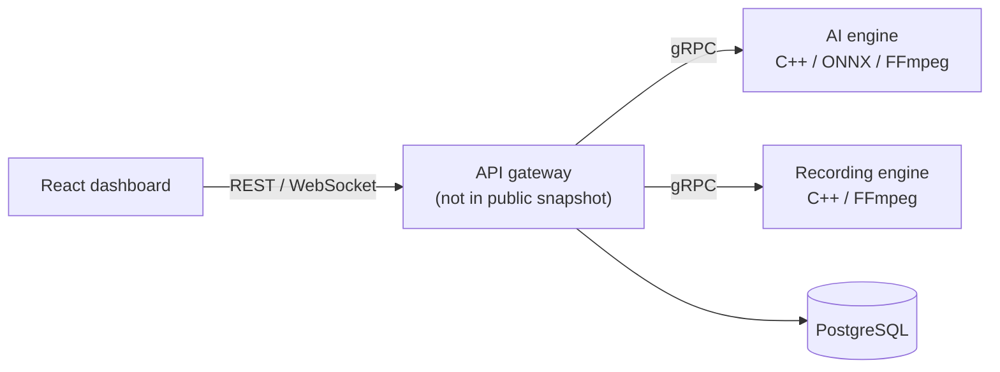

# Techno VMS

[](https://github.com/SudharshanMutalik46/ts_vms/actions/workflows/frontend-ci.yml)


An in-progress video management system for multi-camera monitoring, recording, and AI-assisted event detection. The repository demonstrates a React operations dashboard, C++ service boundaries, gRPC contracts, PostgreSQL migrations, and practical performance and verification documentation.

> [!IMPORTANT]
> This is a development portfolio project, not a production-ready security product. The public snapshot does not currently include the Node.js API gateway required for an end-to-end deployment.

## What is included

- Multi-camera live-view and playback interfaces
- Role-aware authentication state and protected navigation
- AI event dashboard with real-time Socket.IO updates
- Camera health, storage, and configuration screens
- C++17 AI engine using FFmpeg, ONNX Runtime, gRPC, and optional CUDA
- C++17 recording engine using FFmpeg subprocess supervision and gRPC
- PostgreSQL schema and migrations for camera AI features
- Performance baselines, soak-test planning, and a verification checklist
- GitHub Actions validation for the TypeScript frontend

## Architecture



## Repository map

| Path | Purpose | Status |
|---|---|---|
| `frontend/` | Primary React and TypeScript operations dashboard | Builds successfully |
| `backend/ai_engine/` | RTSP decoding and ONNX inference service | Source available; external native dependencies required |
| `backend/recording_engine/` | Recording and disk-layout service | Source available; external native dependencies required |
| `backend/database/` | PostgreSQL schema and migrations | Available |
| `backend/docs/` | Contracts, performance notes, soak plan, and verification checklist | Available |
| Root React files | Earlier standalone dashboard prototype | Kept for reference |
| `backend/api_gateway/` | REST, stream, and gRPC orchestration layer | Not included in the public snapshot |

## Frontend quick start

Prerequisites:

- Node.js 22 or later
- npm 10 or later

```bash
git clone https://github.com/SudharshanMutalik46/ts_vms.git
cd ts_vms/frontend
npm ci
npm run dev
```

Open `http://localhost:5173`.

The development server proxies `/api`, `/streams`, and `/socket.io` to `http://localhost:3000`. A compatible API gateway is required for live data, authentication, and video streams.

Create a production build with:

```bash
cd frontend
npm ci
npm run build
```

## Native services

Both native services require CMake 3.16+, a C++17 compiler, Protobuf, gRPC, and spdlog.

The AI engine additionally requires FFmpeg development libraries and ONNX Runtime. CUDA inference is enabled when the ONNX Runtime CUDA provider is available.

```bash
cmake -S backend/ai_engine -B backend/ai_engine/build -DCMAKE_BUILD_TYPE=Release
cmake --build backend/ai_engine/build --config Release

cmake -S backend/recording_engine -B backend/recording_engine/build -DCMAKE_BUILD_TYPE=Release
cmake --build backend/recording_engine/build --config Release
```

See the [recording engine guide](backend/recording_engine/README.md) and [AI engine contract](backend/docs/ai_engine_contract.md) for component-specific details.

## Engineering notes

- AI frames are resized to the model input size during decoding to reduce avoidable memory and latency overhead.
- The recording engine separates session management, process supervision, disk layout, and gRPC transport.
- Runtime media, models, native binaries, build outputs, archives, and environment files are excluded from version control.
- Verification material is maintained under [`backend/docs`](backend/docs), including the [master checklist](backend/docs/verification/master_checklist.md) and [soak-test plan](backend/docs/soak/phase5_6_soak_plan.md).

## Current roadmap

- [x] Recover and validate the primary TypeScript frontend
- [x] Add automated frontend build checks
- [x] Document public component status and dependencies
- [ ] Publish or replace the API gateway
- [ ] Add containerized local development
- [ ] Add native-engine unit and integration tests
- [ ] Add a sanitized demo and architecture screenshots

## Security

Never commit camera credentials, RTSP URLs, JWTs, private keys, recordings, or model binaries. Use test streams and non-production credentials during development. See [SECURITY.md](SECURITY.md) for reporting guidance.

## Author

**Sudharshan Mutalik**

AWS Cloud Support Engineer · Linux Administrator · DevOps Engineer

[LinkedIn](https://www.linkedin.com/in/sudharshan-mutalik) · [GitHub](https://github.com/SudharshanMutalik46)
